### Hi there 👋

- 🔭 I’m currently working on [Alluxio](https://github.com/alluxio/alluxio) and [Impala](https://github.com/apache/impala).
- 🌱 I’m currently learning Kubernetes.
- 💬 Ask me anything about Big Data and Cloud Native.

